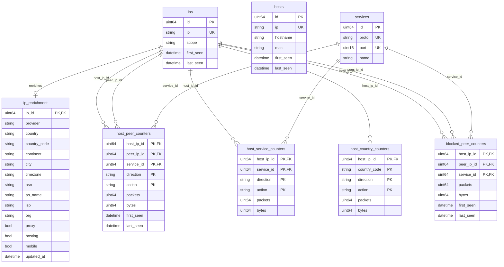
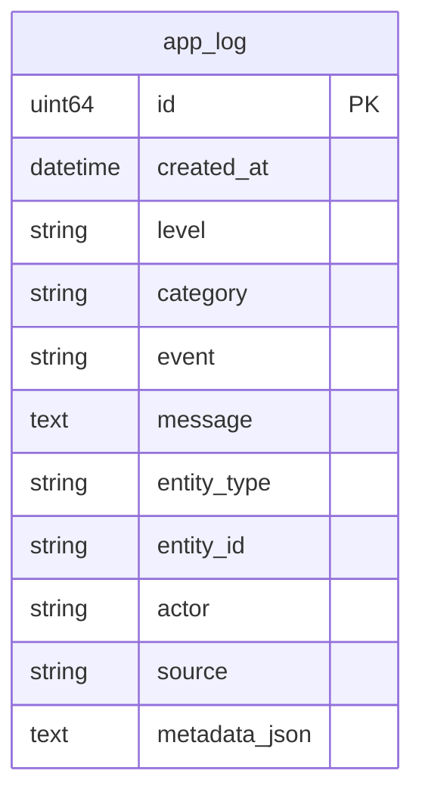

# NTC Database ERD

NTC uses SQLite through Gorm. By default it has two separate database files:

| Database | Config key | Default path |
|---|---|---|
| App logs | `app_logs.path` | `./data/app_logs.db` |
| Analytics | `analytics.path` | `./data/analytics.db` |

The analytics database stores aggregated counters, not raw packet captures.

## Analytics Database



### Important Keys

`services` has one logical unique key:

```text
proto + port
```

`host_peer_counters` groups traffic by:

```text
host_ip_id + peer_ip_id + service_id + direction + action
```

This powers Top Peers. It answers: which peer IPs did each host talk to, split by service, direction, and firewall action?

`host_service_counters` groups traffic by:

```text
host_ip_id + service_id + direction + action
```

This powers Top Services. It answers: which services did each host use, regardless of peer IP?

`host_country_counters` groups traffic by:

```text
host_ip_id + country_code + direction + action
```

This powers country summaries. Country comes from `ip_enrichment.country_code`; missing enrichment becomes `UNKNOWN`.

`blocked_peer_counters` groups blocked traffic by:

```text
host_ip_id + peer_ip_id + service_id
```

It does not currently split blocked counters by direction or action.

## App Log Database



The app log database is independent from analytics. It has no foreign keys to analytics tables.

## UI Tools For Viewing SQLite

Use any SQLite browser against the two `.db` files on the NTC host:

```text
./data/analytics.db
./data/app_logs.db
```

Good options:

| Tool | Use |
|---|---|
| DB Browser for SQLite | Simple desktop GUI for tables and data |
| DBeaver | Full database UI with diagrams |
| SQLite Viewer VS Code extension | Quick table browsing inside VS Code |

For a quick terminal check:

```bash
sqlite3 ./data/analytics.db ".tables"
sqlite3 ./data/analytics.db ".schema host_peer_counters"
```
